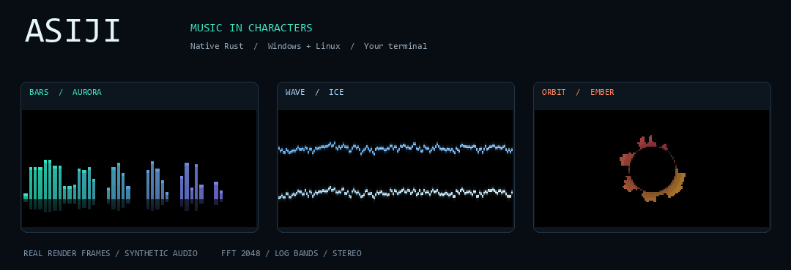

# Визуализатор

[← Главная](../README.md)

Если у трека нет видео, ASIJI рисует музыку прямо в терминале.
Анимация строится по звуковому сигналу; пауза замораживает кадр, перемотка
переносит анализ на новую позицию. Громкость вывода не меняет высоту спектра:
для этого есть отдельная чувствительность `visual_gain`.



Демонстрация собрана из реальных RGB-кадров визуализатора на синтетическом
стереосигнале. В терминале результат зависит от шрифта, размера окна и режима.

| Режим | Вид |
|---|---|
| `bars` | Логарифмический спектр с пиками и отражением |
| `wave` | Две звуковые волны: левый и правый каналы |
| `orbit` | Кольцевой спектр |

| Тема | Цвета |
|---|---|
| `aurora` | Мятный → фиолетовый |
| `ember` | Золотой → розовый |
| `ice` | Голубой → белый |

## Настроить

В меню треков нажмите **S**. Клавишами **↑↓** выберите «Визуализатор»,
«Палитра» или другой параметр; **←→** и **Enter** переключают значение.
Для Orbit выберите `orbit`, для тёплой палитры — `ember`, для HD — `blocks`.
Писать команды вручную не нужно. **E** открывает расширенные текстовые настройки.

**W** сохраняет и применяет настройки для следующего запуска трека.
**Q** отменяет изменения. Во время воспроизведения **H** переключает
ASCII/HD, **C** — цвет/монохром; эти клавиши можно переназначить.

На Windows визуализатор можно показать как [живые обои](WALLPAPER.md).

Те же параметры доступны в [TOML-конфиге](../config.example.toml):

```toml
mode = "blocks"
visualizer = "bars"
visual_theme = "aurora"
visual_gain = 100
visual_smoothing = 80
visual_bands = 48
```

| Параметр | Диапазон | Значение по умолчанию |
|---|---|---|
| `visual_gain` | 10–400%; чувствительность спектра и амплитуда волн | 100 |
| `visual_smoothing` | 0–99%; больше — медленнее затухание спектра | 80 |
| `visual_bands` | 8–128; число полос в Bars/Orbit | 48 |
| `fps` | Общий предел частоты кадров | 30 |
| `width` | Ширина в ячейках; 0 — по размеру окна | 0 |

`visual_smoothing` и `visual_bands` относятся к спектру; Wave отображает
исходную форму обоих каналов. Визуальные параметры не изменяют видео.

```bash
# Linux
./start.sh --mode blocks --visualizer orbit --visual-theme ember --fps 60
```

```bat
:: Windows
start.bat --mode blocks --visualizer wave --visual-theme ice --visual-gain 140
```

CLI имеет приоритет над конфигом. Для более детальной картинки разверните
терминал и уменьшите размер моноширинного шрифта. При рывках уменьшите
`--width` или `--fps`: стоимость вывода растёт с числом ячеек.

## Как это работает

Нативный Rust-рендерер читает подготовленный PCM-кэш. RustFFT анализирует
2048 отсчётов каждого канала с окном Ханна. Мощности каналов складываются
после FFT, поэтому противофазное стерео не исчезает из спектра.
FFT-план, рабочие массивы и RGB-буфер переиспользуются. Дополнительный
процесс FFmpeg для анимации не запускается; GPU для неё не требуется.

Генерация иллюстрации для разработчиков: установите Pillow, затем выполните
`python scripts/render-demo.py`. Используется синтетический сигнал, чужих
треков и видеозаписей в демонстрации нет.
